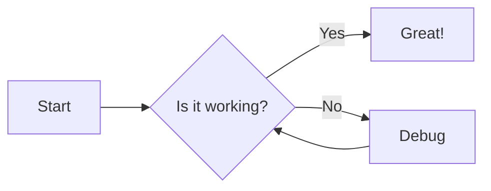
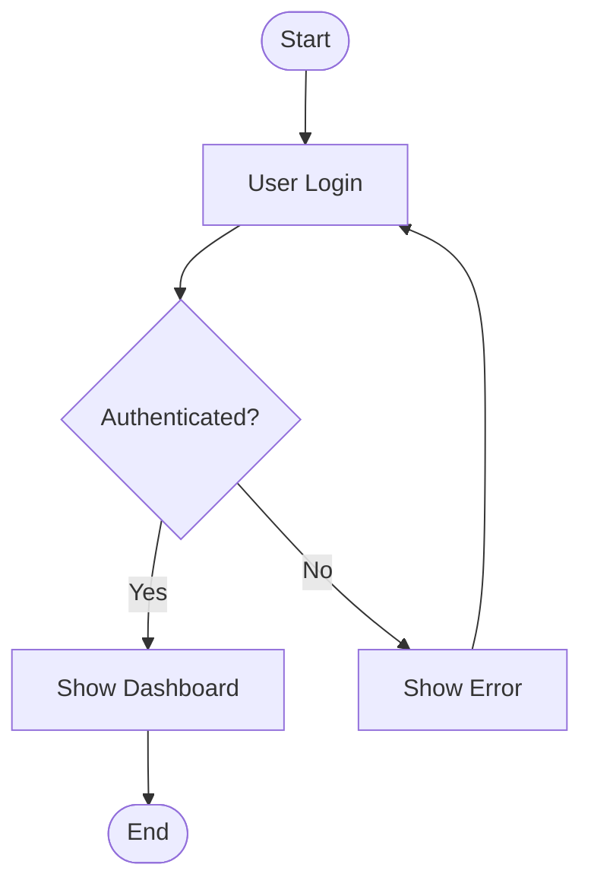
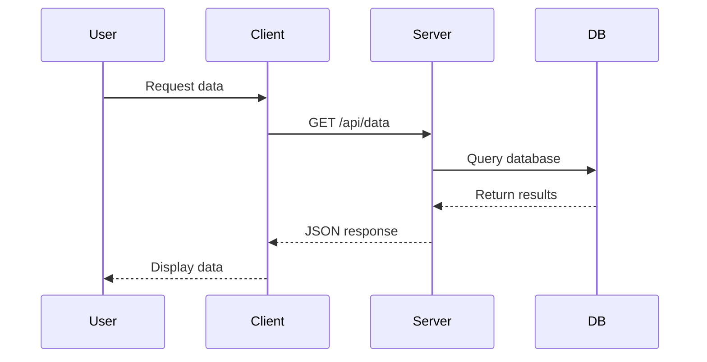
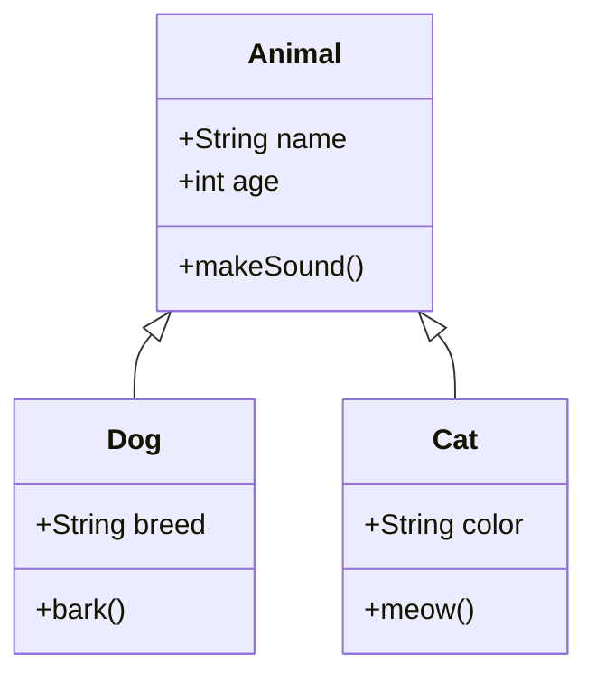

# Mermaid Diagram Skill

Generate Mermaid diagrams and render them to PNG/SVG/PDF images using mermaid-cli (mmdc) command-line tool.

## Requirements

- `@mermaid-js/mermaid-cli` must be installed globally: `npm install -g @mermaid-js/mermaid-cli`
- Verify installation: `mmdc --version`

## Supported Diagram Types

- **flowchart** - Flow charts (LR for left-right, TD for top-down)
- **sequenceDiagram** - Sequence diagrams for API flows, interactions
- **classDiagram** - Class diagrams for OOP design
- **stateDiagram** - State machine diagrams
- **erDiagram** - Entity relationship diagrams
- **gitGraph** - Git commit history visualization
- **pie** - Pie charts
- **gantt** - Gantt charts for project timelines
- **journey** - User journey maps
- **C4Context** - C4 architecture diagrams (requires C4 plugin)
- **mindmap** - Mind maps
- **xyChart** - XY charts

## Output Directory

All generated diagrams are saved to: `~/.nanobot/media/diagram/`, and png files are saved to `~/.nanobot/media/image/`

Default: ~/.nanobot/media/diagram/`

## Usage Workflow

### 1. Write Mermaid Code

Create a `.mmd` file with valid Mermaid syntax. Example flowchart:



### 2. Render to Image

Use `mmdc` command to convert `.mmd` to image:

```bash
mmdc -i input.mmd -o output.png -b transparent
```

Common options:
- `-i, --input`: Input mermaid file
- `-o, --output`: Output file (png, svg, pdf)
- `-b, --background`: Background color (default: white)
- `-w, --width`: Width in pixels (default: 1200)
- `-H, --height`: Height in pixels (default: 800)
- `-p, --padding`: Padding in pixels (default: 10)

### 3. Display the Result

Show the generated image to user using the `image` tool with display mode.

## Examples

### Flowchart Example

**Mermaid code (`workflow.mmd`)**:


**Render command**:
```bash
mmdc -i ~/.nanobot/media/diagram/workflow.mmd \
     -o ~/.nanobot/media/image/workflow.png \
     -b white -w 3200 -H 2400
```

### Sequence Diagram Example

**Mermaid code (`api-flow.mmd`)**:


### Class Diagram Example

**Mermaid code (`classes.mmd`)**:


## Tips

1. **Flowchart direction**: Use `LR` (left-to-right) for horizontal flows, `TD` (top-down) for hierarchical structures
2. **Descriptive labels**: Always use meaningful node labels instead of just A, B, C
3. **Subgraphs**: Group related components using subgraphs for better organization
4. **Styling**: Add styling with `classDef` for consistent appearance
5. **Wide diagrams**: Increase width (`-w`) for wide diagrams; use `-H` for tall diagrams
6. **Transparent background**: Use `-b transparent` for PNGs that need transparency
7. **File naming**: Use kebab-case descriptive filenames (e.g., `auth-flow.mmd`, `system-architecture.mmd`)

## Common Issues

- **"mmdc not found"**: Install mermaid-cli globally: `npm install -g @mermaid-js/mermaid-cli`
- **Syntax errors**: Validate your mermaid code at https://mermaid.live before rendering
- **Output too small**: Increase width/height parameters or let mmdc auto-size
- **Font issues**: Some fonts may not render correctly; stick to standard ASCII characters

## Reference Files

For more examples and patterns, visit:
- Official Mermaid Docs: https://mermaid.js.org/
- Mermaid Live Editor: https://mermaid.live/
